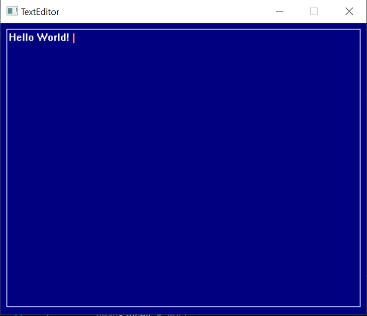

# TextEditor

This project has been created on Visual Studio in C++ using Borland Graphics Interface(BGI). BGI is a graphics library which provides several functions which can be used to create graphical applications. This library is used in this project to design a Text Editor in C++.

It's a simple Text Editor made from scratch in C++, which implements all the basic features you expect in a minimal editor. The editor is functional, you can write text, delete it, select it, copy it, cut it and paste it. 
The GUI looks as follows.

The editor uses BGI library as graphics controller, so it is needed for compiling. But you do not have to install the BGI library files explicitly as I have included all the files from the BGI library. You can run the project by simply opening ``bgi.sln`` file in Visual Studio and then executing the ``TextEditor.cpp`` file. 

For more information on BGI, please refer to https://home.cs.colorado.edu/~main/cs1300/doc/bgi/bgi.html
